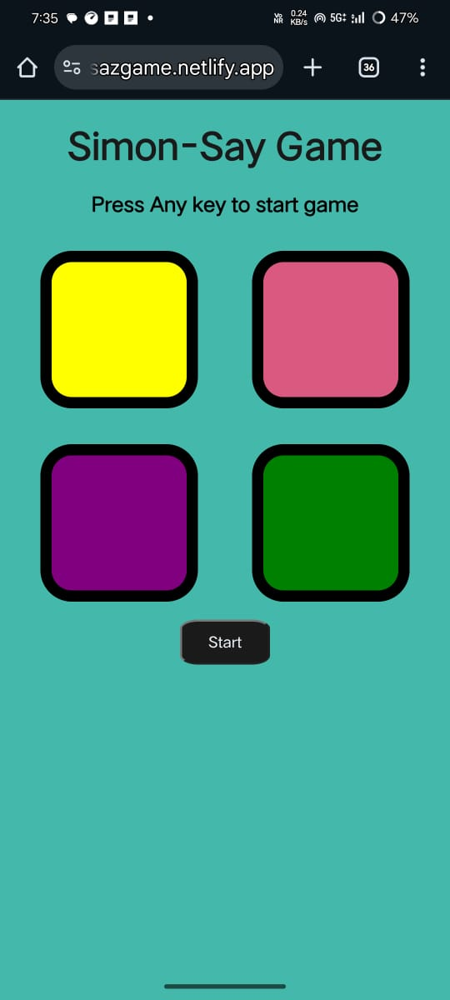
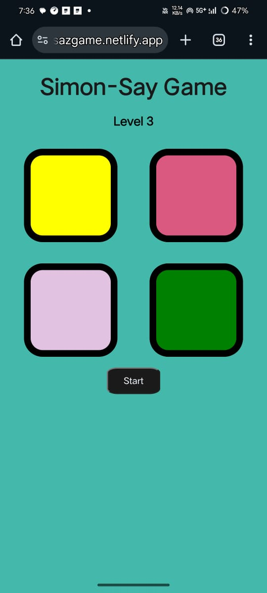
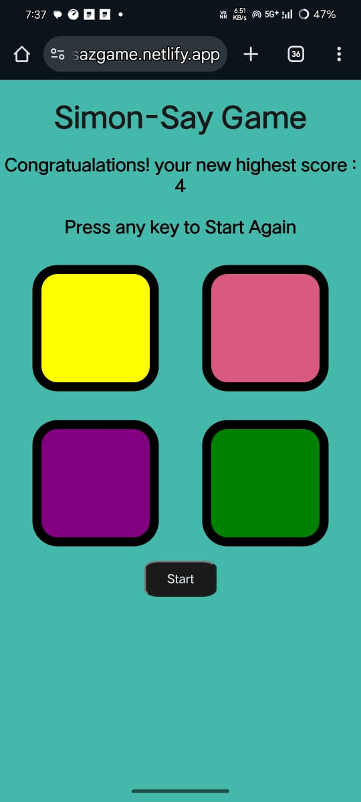

# Simon Says Game

A classic Simon Says memory game built with HTML, CSS, and JavaScript. Test your memory skills by following the sequence of colors that Simon shows you!

## 🎮 Features

- Interactive color-based gameplay
- Progressive difficulty with increasing levels
- Score tracking with highest score memory
- Visual feedback with color flashes
- Responsive design
- Keyboard and button controls
- Game over detection with score display

## 📸 Screenshots


*Initial game screen*


*Game in action showing color sequence*


*Game over screen with score display*

## 🛠️ Technologies Used

- HTML5
- CSS3
- JavaScript (Vanilla)

## 🚀 How to Play

1. Press any key or click the "Start" button to begin the game
2. Watch the sequence of colors that Simon shows you
3. Repeat the sequence by clicking the colors in the same order
4. Each successful round increases the level and adds a new color to the sequence
5. The game continues until you make a mistake
6. Your score is based on the level you reach
7. Try to beat your highest score!

## 💻 Setup and Installation

1. Clone the repository:
```bash
git clone https://github.com/shashidhar078/SimonsayBasic.git
```

2. Navigate to the project directory:
```bash
cd SimonsayBasic
```

3. Open `index.html` in your web browser to start playing!

## 🎯 Game Rules

- The game shows a sequence of colors
- You must repeat the sequence exactly as shown
- Each level adds one more color to the sequence
- The game ends when you make a mistake
- Your score is the level you reached
- The highest score is saved during your session

## 🎨 Color Scheme

- Yellow
- Red
- Purple
- Green

## 🤝 Contributing

Feel free to fork this repository and submit pull requests for any improvements.

## 📝 License

This project is open source and available under the [MIT License](LICENSE).

## 👨‍💻 Author

[Shashidhar Nagunuri]

---
Made with ❤️ using HTML, CSS, and JavaScript